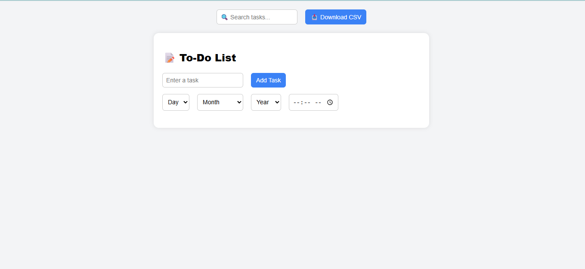
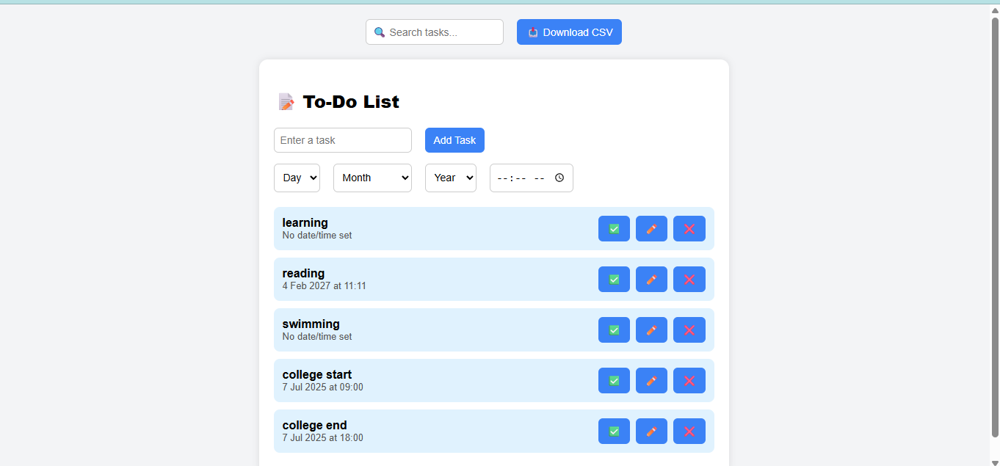
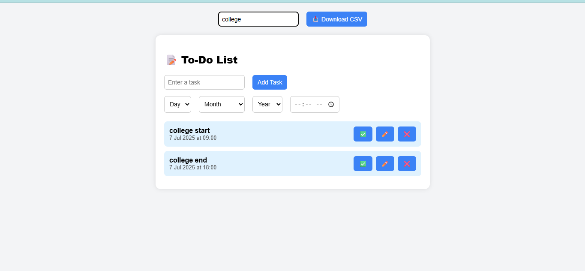
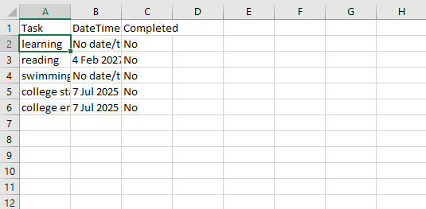

# 📝 To-Do List Web App

This is a fully functional, beginner-friendly **To-Do List Web Application** created using HTML, CSS, and JavaScript. 
It allows users to manage daily tasks easily with features such as date and time assignment, task editing, completion tracking, local storage persistence, and CSV export.

---

## 📸 Screenshots

### 1. 🔲 Before Adding Any Tasks
> A clean interface ready for new tasks.

### 2. ➕ After Adding Tasks
> Tasks displayed as stylish cards with edit, delete, and complete buttons.

### 3. 🔍 Searching a Task
> Instantly filter your tasks with the search bar.

### 4. 📦 Downloaded CSV File
> Easily export your tasks to a CSV file viewable in Excel or Sheets.

---

## ✨ Features

- ✅ Add, edit, and delete tasks
- 📅 Select date, month, and year using dropdowns
- ⏰ Assign time to each task
- ✅ Mark tasks as completed with a visual tick
- 🔍 Real-time search/filter tasks
- 💾 Auto-save to `localStorage` (tasks persist on refresh)
- 📥 Export tasks to `.csv` file
- 📱 Mobile-responsive layout
- 🎨 Card-based modern UI

---

---

## 📦 Technologies Used

- HTML5 for structure  
- CSS3 for styling  
- JavaScript (ES6) for logic and interactivity  
- `localStorage` for persistent task storage  
- Blob API for CSV file generation  

---

## 🚀 How to Use

1. Clone this repository or download the ZIP  
2. Open `index.html` in your browser  
3. Type your task, select date and time, and click **"Add Task"**  
4. Use search bar to filter tasks  
5. Click ✅ to mark done, ✏️ to edit, ❌ to delete  
6. Click 📥 **Download CSV** to export your tasks

---

## 🔒 Data Persistence

This app uses the browser’s `localStorage` to save your tasks. You don’t need an account or internet to use it. Your tasks will stay saved even if you close or refresh the browser.

---

## 📞 Contact

Created by **Aniket Vishwakarma**

📧 Email: [aniketvis675@gmail.com](mailto:aniketvis675@gmail.com)  
🌐 GitHub: [github.com/aniketvishwakarma-11](https://github.com/aniketvishwakarma-11)   
💬 Open to collaboration and contributions!

---

## 🪪 License

This project is licensed under the **MIT License**.  
Feel free to use, modify, and share it with credit.

---

